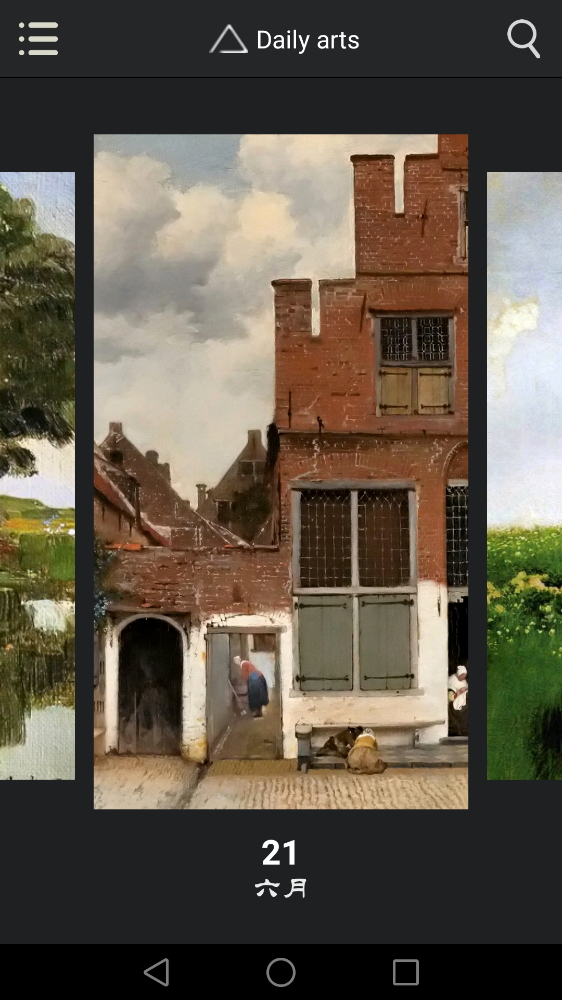
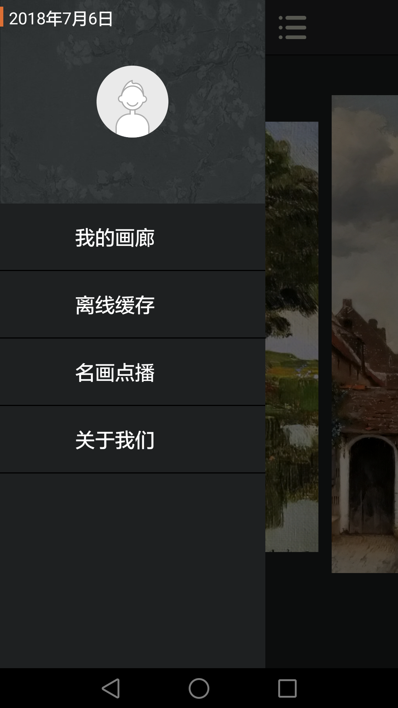
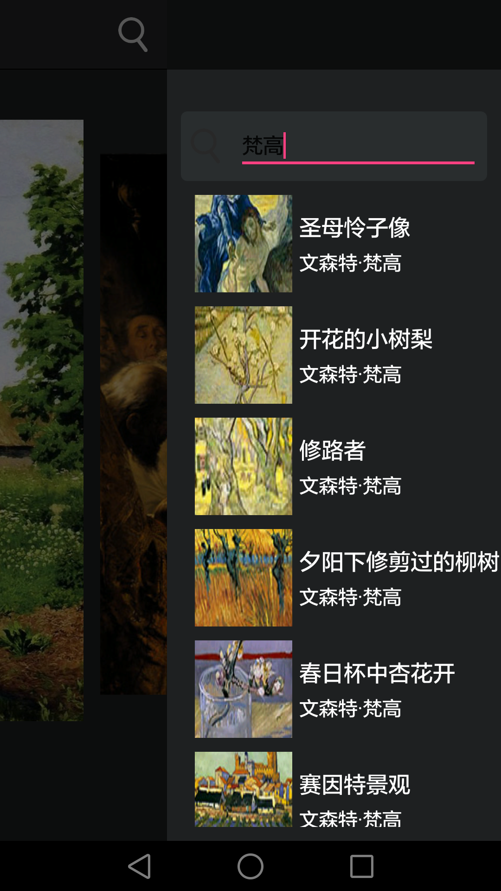
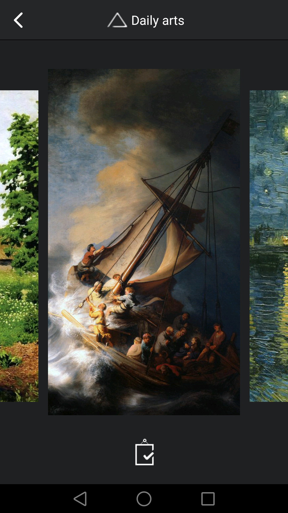
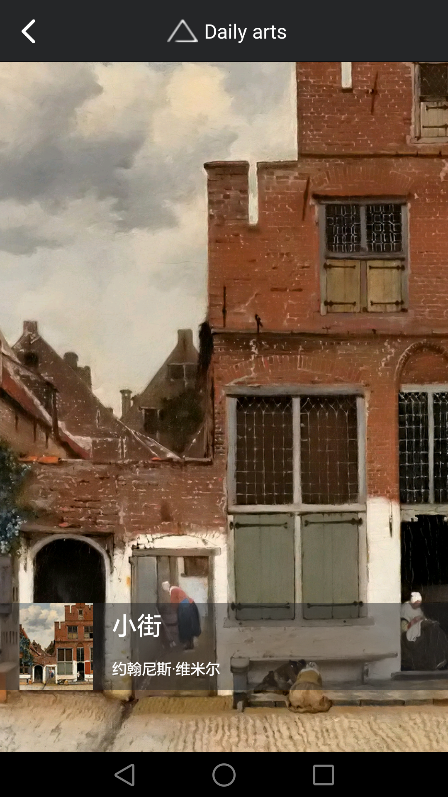
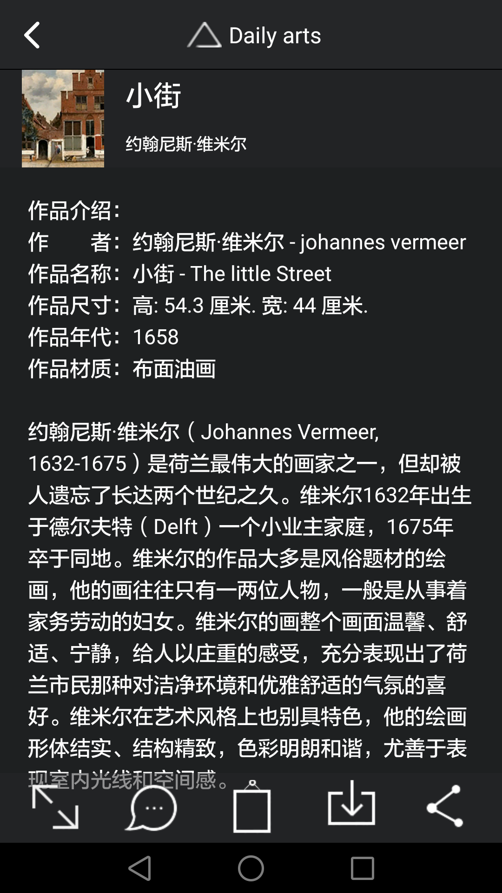

# DailyArts
　　本项目仿IOS端的一款叫DailyArts的APP，目的是在Android端实现尽量多的功能和近似的效果。

<h3>项目简介</h3>

　　每日名画是一款每天向您推送世界著名绘画作品的应用,并且可以将伟大作品瞬间囊入手中,甚至作为壁纸。还在使用形形色色的花纹当壁纸吗,跟我一起去享受梵高的星空吧!

　　在这里,您可以欣赏到达芬奇;凡高;塞尚;莫奈塞尚;贾科莫·巴拉;马修。史密斯爵士;克拉姆斯科依;丢勒;丁托列托;毕加索;高更;列宾;卢梭达利;米勒;雷诺阿;夏加尔;康丁斯基;米罗;马奈;鲁本斯;马赛尔·杜尚;约翰·皮波的著名作品,还有中国与亚洲的一大批古典艺术家的大作:诸如郎世宁,张大千,徐悲鸿等画家呕心沥血的巨制,亚洲的日本浮世绘,传统韩国应用等等,许许多多璀璨文明的艺术作品尽在其中。

　　您钟爱的作品,诸如耳熟能详的:《蒙娜丽莎》《星空》,《向日葵》,《入睡的维纳斯》,《无名女郎》,《吹笛少年》等,都会随着新一天的到来准时送到您的面前,供您欣赏。您可以轻易的下载作为璧纸,甚至可以看到不为认知的细节。并且当您轻点名画的信息,您还可以了解油画背后的故事,画家的生卒年,画家的生平,除此之外,还有画作的奇闻异事,是那么的有趣和富有知识性。

　　每日名画将坚持在未来的日子里一直为您更新,成为您一天在城市中疲惫的度过喧嚣后一个心灵上的美术星空。

<h3>项目截图</h3>
<table>
  <tr>
    <td align="center">首页</td>
    <td align="center">用户设置页面</td>
    <td align="center">查找名画页</td>
  </tr>
  <tr>
    <td></td>
    <td></td>
    <td></td>
  </tr>
  <tr>
    <td align="center">我的收藏页</td>
    <td align="center">图片详情页</td>
    <td align="center">图片描述页</td>
  </tr>
  <tr>
    <td></td>
    <td></td>
    <td></td>
  </tr>
</table>

<h3>项目分包</h3>
<table>
  <tr>
    <th>包名</th>
    <th>描述</th>
  </tr>
  <tr>
    <td>config</td>
    <td>存在SharedPreference中的配置参数，以及全局常数类</td>
  </tr>
  <tr>
    <td>contract</td>
    <td>VP层协议接口</td>
  </tr>
  <tr>
    <td>entity</td>
    <td>实体模型</td>
  </tr>
  <tr>
    <td>event</td>
    <td>EventBus中的Event对象类</td>
  </tr>
  <tr>
    <td>net</td>
    <td>网络相关</td>
  </tr>
  <tr>
    <td> </td>
    <td>api:网络请求接口</td>
  </tr>
  <tr>
    <td>presenter</td>
    <td>MVP中P实现类</td>
  </tr>
  <tr>
    <td>receiver</td>
    <td>四大组件中的receiver</td>
  </tr>
  <tr>
    <td>repository</td>
    <td>MVP中M层接口及实现类，主要包括数据操作部分逻辑，包括网络数据、文件、SP存取</td>
  </tr>
  <tr>
    <td>router</td>
    <td>ARouter的简单封装</td>
  </tr>
  <tr>
    <td>service</td>
    <td>四大组件中的service</td>
  </tr>
  <tr>
    <td>ui</td>
    <td>UI相关类</td>
  </tr>
  <tr>
    <td></td>
    <td>activity</td>
  </tr>
  <tr>
    <td></td>
    <td>adapter</td>
  </tr>
  <tr>
    <td></td>
    <td>fragment</td>
  </tr>
  <tr>
    <td></td>
    <td>transformation：图像变换、动画变换类</td>
  </tr>
  <tr>
    <td></td>
    <td>widget：自定义控件、对话框等</td>
  </tr>
  <tr>
    <td>utils</td>
    <td>各种工具类</td>
  </tr>
  <tr>
    <td></td>
    <td>CacheUtils：app缓存管理</td>
  </tr>
  <tr>
    <td></td>
    <td>CommomUtils：常规工具类（获取进程名、判断程序是否显示在前端等）</td>
  </tr>
  <tr>
    <td></td>
    <td>DeviceInfo：设备信息以及硬件信息</td>
  </tr>
  <tr>
    <td></td>
    <td>ImageLoadUtils：图片加载Glide封装类</td>
  </tr>
  <tr>
    <td></td>
    <td>OSUtils：系统类型判断</td>
  </tr>
  <tr>
    <td></td>
    <td>SharedPreferencesUtils：sp存储相关</td>
  </tr>
  <tr>
    <td></td>
    <td>StatusBarUtils：状态栏相关</td>
  </tr>
  <tr>
    <td></td>
    <td>StringUtils：字符串</td>
  </tr>
  <tr>
    <td></td>
    <td>ToastUtils：弹窗类</td>
  </tr>
</table>

<h3>MVP各层编写规范</h3>
本小节主要介绍每日名画App各模块、逻辑层级以及相关类的书写开发规范
<h4>1.M层</h4>
M层主要业务逻辑为数据操作部分，包括数据的网络获取、数据库操作、文件操作（SharedPreference操作待定），仅包含数据的CURD操作，不包含逻辑处理。

操作类需要的Context从BaseApplication中获取。

M层返回对象统一封装为Observable，线程切换，生命周期管理同意在M层处理。<b>实施过程：</b>M层Repository对象继承BaseRepository后，构造方法传入RxLifecycleBinder引用，并确保调用其super方法，之后可调用基类中的defaultRxConfig()方法，来处理线程切换（默认为io线程和主线程的切换）以及生命周期内Observable资源处理。其中RxLifecycleBinder接口在BaseActivity中实现，只需在构造Repository的时候传入Activity引用即可。

数据操作需要注意线程切换问题，耗时操作需注意在子线程中进行，开启子线程及数据类转换通过RxUtil实现。

M层Repository对象编写实例：

    // 获取主页中每一天的图片
    public class GalleryImagesRepository extends BaseRepository implements GalleryImagesDataSource {
        // 构造函数传入RxLifecycleBinder应用，调用super方法    
        public GalleryImagesRepository(RxLifecycleBinder binder) {
            super(binder);
        }

        // 网络数据操作
        @Override
        public Observable<Response<ImageMessageModel>> getGalleryImage(int date) {
            return DailyArtsAPI.getInstance().getImageMessage(date);
        }
    }
BaseRepository实现细节：
    
    public abstract class BaseRepository {

        protected RxLifecycleBinder mLifecycleBinder;

        public BaseRepository(RxLifecycleBinder binder) {
            mLifecycleBinder = binder;
        }

        public BaseRepository() {}

        public <T> Observable.Transformer<T,T> defaultRxConfig() {
            if (null == mLifecycleBinder) throw new IllegalArgumentException("RxLifecycleBinder is null.");
            return tObservable -> tObservable
                .observeOn(AndroidSchedulers.mainThread())
                .subscribeOn(Schedulers.io())
                .compose(mLifecycleBinder.bindLifecycle());
        }
    }
<h4>2.P层</h4>
P层主要完成数据输入输出过程中的逻辑加工过程。其中主要包括数据输入阶段的有效性验证，请求对象的封装，和输出阶段数据加工，展示逻辑输出展示数据。

P层逻辑上应该为普通Java类，其中不应该出现Android相关类，其中包括Context类，这样设计的好处是，以后Presenter层对象可脱离Android生产环境独立编写，独立测试。

contract中定义P层和V层的接口

    public interface GalleryImagesContract {
        // view接口
        interface IView {
            void loadPicture(ImageModel imageModel);

            void loadPictureFail(String errorMessage);
        }
        // presenter接口
        interface IPresenter {
            void getImage(int date);
        }
    }
P层的Presenter对象编写实例

    public class GalleryImagePresenter implements GalleryImagesContract.IPresenter {

        private GalleryImagesContract.IView mView;
        private GalleryImagesRepository mGalleryImagesRepository;

        public GalleryImagePresenter(GalleryImagesContract.IView view, GalleryImagesRepository galleryImagesRepository) {
            mView = view;
            mGalleryImagesRepository = galleryImagesRepository;
        }

        @Override
        public void getImage(int date) {
            mGalleryImagesRepository.getGalleryImage(date)
                .observeOn(AndroidSchedulers.mainThread())
                .subscribeOn(Schedulers.io())
                .subscribe(new NetSubscriber<ImageMessageModel>() {
                    @Override
                    public void onSuccess(ImageMessageModel imageMessageModel) {
                        mView.loadPicture(imageMessageModel.getData());
                    }

                    @Override
                    public void onFailure(NetError error) {
                        mView.loadPictureFail(error.message);
                    }
                });
        }
    }
<h4>3.V层</h4>

    public class GalleryItemFragment extends BaseFragment implements GalleryImagesContract.IView {
        private GalleryImagesContract.IPresenter mPresenter;
        private ImageModel mImageModel; // 每日图片信息类
        ...省略布局文件的控件变量和其余状态变量...
        // fragment布局文件
        @Override
        protected int getLayoutResource() {
            return R.layout.gallery_item;
        }

        // view初始化
        @Override
        protected void onInitView() {
            // 初始化Presenter
            mPresenter = new GalleryImagePresenter(this, new GalleryImagesRepository(getHoldingActivity()));
            ...省略控件初始化和监听事件绑定...
            mPresenter.getImage(mDateModel.toInt()); // 获取每日图片信息
        }

        // 获取每日图片信息成功
        @Override
        public void loadPicture(ImageModel imageModel) {
            if(getContext() == null) return;
            mImageModel = imageModel;
            loadingImages(); // 加载图片的具体函数
        }
        // 获取每日图片信息失败
        @Override
        public void loadPictureFail(String errorMessage) {
            if(getContext() == null) return;
            ToastUtils.show(getContext(), errorMessage); // 打印错误信息
        }
    }
<h4>MVP各层分割及对应关系</h4>
VP层为一对一关系，数据的展示和相应加工过程对应。复杂的页面，Fragment和VP层关系可为一对一，也可为一对多。VP层和M层为多对一关系。Net层API类和Repository类为一对一关系。
<h3>项目细节目录</h3>
<ol>
	<li><a href="https://freeksg66.github.io/">仿ios中Drawer的实现</a></li>
	<li><a href="https://freeksg66.github.io/">圆形图像加载的实现</a></li>
	<li><a href="https://freeksg66.github.io/">清空缓存的实现</a></li>
	<li><a href="https://freeksg66.github.io/">在App内发送邮件的功能</a></li>
	<li><a href="https://freeksg66.github.io/">自定义ViewPager的切换动画</a></li>
	<li><a href="https://freeksg66.github.io/">属性动画的学习——图片详情页动画逻辑的实现</a></li>
	<li><a href="https://freeksg66.github.io/">画一个分享页面</a></li>
	<li><a href="https://freeksg66.github.io/">App异常捕获（Bugly + 本地收集）</a></li>
	<li><a href="https://freeksg66.github.io/">组件化初试——简单封装一个ActionBar</a></li>
	<li><a href="https://freeksg66.github.io/">异步之EventBus vs RxJava——收藏图像状态的更新</a></li>
</ol>
详情请见<a href="https://freeksg66.github.io/">高乐的博客</a>（陆续更新中）
